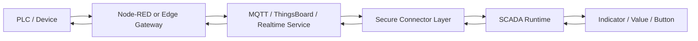
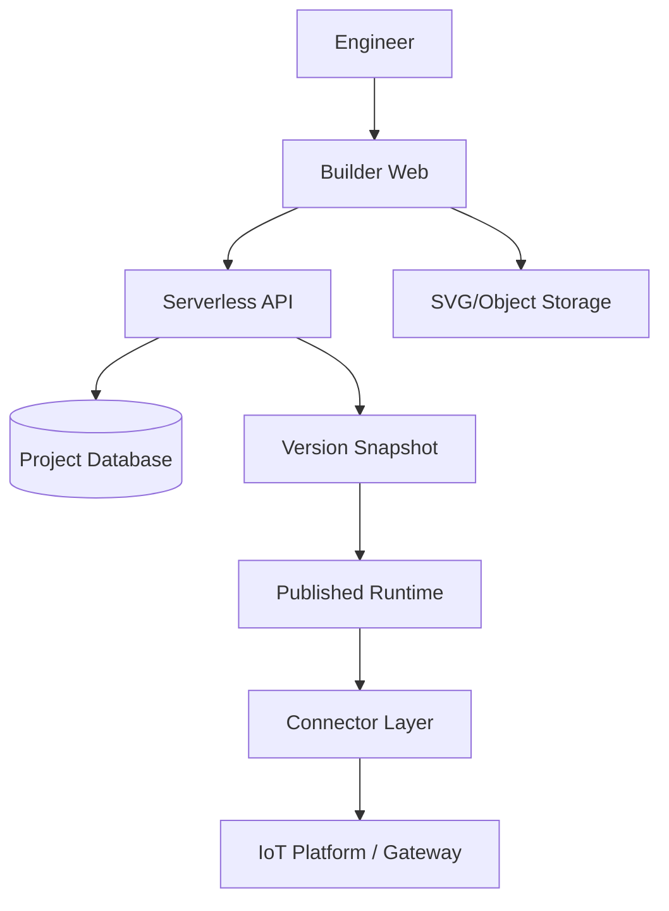

# Product Requirements Document (PRD)

## SCADA Schematic Builder

| Metadata | Detail |
|---|---|
| Product name | SCADA Schematic Builder |
| Working module name | `scamatic.builder` |
| Document | Product Requirements Document |
| Status | Draft for development |
| Priority | High |
| Baseline application | WTP SCADA HMI — `https://scada-mixer.vercel.app/` |
| Baseline stack | Vite, React, lightweight serverless backend |
| Primary users | SCADA engineer, automation engineer, system integrator, operator, project administrator |

---

## 1. Executive Summary

SCADA Schematic Builder adalah platform berbasis web yang memungkinkan pengguna membuat tampilan SCADA/HMI interaktif tanpa harus menyusun setiap elemen antarmuka secara manual melalui kode.

Pengguna dapat:

1. Membuat proyek SCADA baru.
2. Mengunggah gambar skematik dalam format SVG.
3. Menempatkan komponen interaktif di atas skematik.
4. Menghubungkan komponen dengan tag atau sumber data.
5. Melakukan simulasi dan preview secara real-time.
6. Mempublikasikan hasil builder sebagai halaman runtime SCADA.

Komponen utama pada versi awal adalah:

- **Indicator Lamp** untuk menampilkan kondisi boolean atau status mesin.
- **Value Span** untuk menampilkan nilai sensor atau process variable.
- **Control Button** untuk mengirim perintah, RPC, atau perubahan nilai.

Produk harus mendukung penggunaan yang sederhana untuk proyek kecil, tetapi arsitekturnya tetap memungkinkan penambahan komponen industri seperti gauge, trend chart, alarm banner, tank level, valve, motor, dan pump pada versi berikutnya.

---

## 2. Latar Belakang

Pembuatan tampilan SCADA berbasis web biasanya membutuhkan pekerjaan berulang:

- Mengimpor atau menggambar ulang skematik proses.
- Menentukan posisi indikator dan nilai secara manual melalui CSS.
- Membuat binding antara elemen UI dan data dari PLC, gateway, MQTT broker, Node-RED, atau platform IoT.
- Menulis logika perubahan warna, status, format angka, dan aksi tombol.
- Mengubah kode setiap kali layout atau tag berubah.

Pendekatan tersebut masih efektif untuk satu proyek, tetapi kurang efisien ketika sistem harus digunakan pada banyak mesin, area produksi, atau pelanggan.

SCADA Schematic Builder mengubah proses tersebut menjadi workflow visual dan berbasis konfigurasi. Hasil builder disimpan sebagai project schema sehingga tampilan dapat dibuka kembali, direvisi, di-versioning, dan dijalankan oleh runtime renderer yang sama.

---

## 3. Product Vision

> Menjadi platform low-code untuk membangun SCADA web dari skematik SVG, dengan data binding yang sederhana, runtime yang ringan, dan deployment yang praktis.

Produk harus membuat proses berikut terasa natural:

> Upload SVG → letakkan komponen → pilih tag → preview → publish.

---

## 4. Tujuan Produk

### 4.1 Tujuan utama

- Mengurangi kebutuhan menulis kode front-end untuk setiap tampilan SCADA.
- Membuat skematik SVG menjadi halaman monitoring dan control interaktif.
- Menyediakan komponen standar yang dapat dikonfigurasi dari property panel.
- Memisahkan konfigurasi tampilan dari kode aplikasi.
- Mendukung koneksi data melalui adapter yang aman dan dapat diperluas.
- Menghasilkan runtime SCADA yang ringan untuk deployment berbasis web.

### 4.2 Indikator keberhasilan

- Pengguna dapat membuat satu dashboard SCADA dasar tanpa mengubah source code.
- Waktu dari upload SVG sampai preview pertama kurang dari 10 menit untuk pengguna yang sudah memahami tag data.
- Perubahan posisi, style, dan binding dapat dilakukan dari builder.
- Project dapat disimpan dan dibuka kembali tanpa kehilangan konfigurasi.
- Runtime dapat memulihkan koneksi setelah network interruption.
- Satu schema proyek dapat digunakan secara konsisten pada editor, preview, dan published runtime.

---

## 5. Non-Goals untuk MVP

Fitur berikut belum menjadi target MVP:

- Menggantikan PLC programming software.
- Menjalankan ladder logic, function block, atau safety logic.
- Menghubungkan browser langsung ke jaringan PLC tanpa gateway.
- Menjadi historian industri penuh.
- Menjadi alarm management system yang memenuhi seluruh standar industri.
- Menjadi pengganti penuh WinCC, FactoryTalk, Ignition, AVEVA, atau platform SCADA enterprise lainnya.
- Mendukung collaborative editing real-time seperti Figma pada rilis pertama.
- Mengedit node, path, atau geometry SVG secara penuh seperti aplikasi desain vektor.

---

## 6. Persona Pengguna

### 6.1 SCADA/Automation Engineer

Kebutuhan:

- Mengunggah skematik proses.
- Menempatkan indikator dan kontrol dengan cepat.
- Menghubungkan komponen ke tag PLC atau IoT.
- Menguji state tanpa harus mengaktifkan plant sesungguhnya.

### 6.2 System Integrator

Kebutuhan:

- Menggunakan template proyek untuk beberapa pelanggan.
- Mengelola konfigurasi konektor yang berbeda.
- Men-deploy runtime tanpa membagikan source code editor.
- Melakukan versioning dan rollback.

### 6.3 Operator

Kebutuhan:

- Melihat kondisi plant dengan jelas.
- Mengetahui apakah data masih online atau stale.
- Menjalankan perintah hanya jika memiliki izin.
- Mendapatkan konfirmasi sebelum aksi kritis dikirim.

### 6.4 Project Administrator

Kebutuhan:

- Mengelola user, role, project, dan environment.
- Mengatur siapa yang dapat mengedit atau hanya melihat.
- Meninjau audit log publikasi dan control command.

---

## 7. Product Principles

1. **Configuration over custom code**
   Sebagian besar kebutuhan dashboard harus diselesaikan dari konfigurasi.

2. **Safe by default**
   SVG, ekspresi, kredensial, dan control command harus diproses secara aman.

3. **Runtime is not the editor**
   Runtime produksi harus lebih ringan dan memiliki permukaan serangan yang lebih kecil daripada builder.

4. **Data source agnostic**
   Komponen terhubung ke normalized tag, bukan langsung bergantung pada satu vendor.

5. **Observable state**
   User harus dapat membedakan nilai normal, alarm, stale, disconnected, dan invalid.

6. **Industrial clarity**
   Animasi dan visual tidak boleh mengurangi keterbacaan kondisi proses.

---

## 8. Ruang Lingkup Produk

### 8.1 MVP

- Authentication dasar.
- Workspace dan project management.
- Upload dan sanitasi SVG.
- Builder canvas dengan zoom, pan, select, drag, resize, dan layer ordering.
- Tiga komponen utama: lamp, value span, dan button.
- Property inspector.
- Tag manager.
- Static/mock data source.
- REST polling adapter.
- WebSocket adapter atau managed realtime adapter.
- Preview mode.
- Save draft.
- Publish runtime.
- Project version snapshot.
- Viewer dan editor role.
- Basic audit trail.

### 8.2 Versi 1.x

- MQTT melalui secure backend/gateway.
- ThingsBoard adapter.
- Node-RED webhook/RPC adapter.
- Alarm rules sederhana.
- Trend chart.
- Gauge dan tank level.
- Reusable symbols dan component groups.
- Project template.
- Import/export project JSON.
- Environment variables per development, staging, dan production.

### 8.3 Future scope

- Collaborative editing.
- Component marketplace.
- Custom component SDK.
- OPC UA adapter melalui edge gateway.
- Modbus TCP adapter melalui edge gateway.
- Historian dan reporting.
- Multi-screen navigation designer.
- Mobile operator view.
- Digital twin animation.
- AI-assisted tag binding dan layout generation.

---

## 9. Information Architecture

```text
Application
├── Authentication
├── Workspace
│   ├── Projects
│   ├── Members
│   └── Environments
├── Project
│   ├── Overview
│   ├── Builder
│   │   ├── Canvas
│   │   ├── Component Library
│   │   ├── Layers
│   │   ├── Tag Manager
│   │   └── Property Inspector
│   ├── Data Sources
│   ├── Preview
│   ├── Versions
│   ├── Publish
│   └── Settings
└── Runtime
    ├── SCADA Screen
    ├── Connection Status
    ├── Command Confirmation
    └── Runtime Error State
```

---

## 10. Core User Flow

### 10.1 Membuat proyek

1. User login.
2. User memilih workspace.
3. User memilih **New Project**.
4. User mengisi nama, slug, deskripsi, canvas size, dan environment awal.
5. Sistem membuat project kosong.

### 10.2 Mengimpor skematik

1. User membuka Builder.
2. User mengunggah file SVG.
3. Sistem memvalidasi ukuran dan MIME type.
4. Sistem melakukan sanitasi SVG.
5. Sistem menampilkan preview hasil sanitasi.
6. User mengonfirmasi penggunaan SVG.
7. SVG menjadi background atau base schematic layer.

### 10.3 Menambahkan komponen

1. User memilih komponen dari library.
2. User melakukan drag and drop ke canvas.
3. Sistem membuat instance komponen.
4. User mengatur posisi, ukuran, style, dan label.
5. User memilih tag atau membuat binding baru.
6. User menguji komponen menggunakan mock value.

### 10.4 Preview

1. User memilih **Preview**.
2. Editor chrome disembunyikan.
3. Runtime engine membaca draft schema.
4. Sistem mengaktifkan data adapter yang dipilih.
5. Komponen berubah mengikuti nilai tag.
6. Control command pada preview harus menggunakan mock mode atau environment yang memang diizinkan.

### 10.5 Publish

1. User memilih **Publish**.
2. Sistem menjalankan validation checks.
3. Sistem menampilkan daftar warning dan error.
4. Jika valid, sistem membuat immutable version snapshot.
5. Snapshot ditetapkan sebagai active runtime version.
6. Published URL diperbarui tanpa rebuild aplikasi utama.

---

## 11. Functional Requirements

## FR-01 — Authentication dan Authorization

### Requirement

- User dapat login dan logout.
- Sistem minimal memiliki role:
  - `OWNER`
  - `ADMIN`
  - `EDITOR`
  - `OPERATOR`
  - `VIEWER`
- Permission harus dapat dibedakan antara:
  - Mengelola project.
  - Mengedit builder.
  - Mengubah data source.
  - Publish.
  - Menjalankan control command.
  - View only.

### Acceptance criteria

- Viewer tidak dapat membuka editor dalam mode write.
- Operator dapat menjalankan command hanya pada project yang diberikan.
- Editor tidak otomatis berhak mengubah secret konektor.
- Semua publish dan command penting dicatat ke audit log.

---

## FR-02 — Workspace dan Project Management

### Requirement

Setiap project memiliki:

- ID internal.
- Name.
- Slug.
- Description.
- Canvas width dan height.
- Background color.
- Base SVG asset.
- Draft schema.
- Published version.
- Environment configuration.
- Created by dan updated by.
- Created at dan updated at.

### Project actions

- Create.
- Duplicate.
- Rename.
- Archive.
- Delete dengan confirmation.
- Export configuration.
- Import configuration.

### Acceptance criteria

- Slug unik di dalam workspace.
- Project archive tidak muncul pada daftar aktif secara default.
- Delete tidak dapat dilakukan tanpa confirmation phrase atau confirmation modal.
- Duplicate menghasilkan ID, slug, dan version history baru.

---

## FR-03 — SVG Import dan Asset Processing

### Supported input

- Format: `.svg`.
- MIME yang diterima: `image/svg+xml`.
- File size default maksimum: 5 MB, dapat dikonfigurasi.
- SVG dimensions harus dapat dibaca dari `viewBox`, `width`, atau `height`.

### Security processing

Sistem harus menghapus atau menolak:

- `<script>`.
- Inline event handler seperti `onclick`, `onload`, dan sejenisnya.
- External resource yang tidak diizinkan.
- `<foreignObject>` pada MVP.
- JavaScript URL.
- Embedded iframe.
- Style atau reference yang mencoba keluar dari scope asset.
- Entity atau payload yang berpotensi menyebabkan parser abuse.

### Processing modes

1. **Background mode**
   SVG dianggap sebagai satu base layer dan tidak dapat diedit per-path.

2. **Selectable element mode — future**
   Elemen dengan ID tertentu dapat dipilih sebagai target binding atau animation.

### UX requirement

- Preview before confirm.
- Pesan sanitasi menjelaskan elemen yang dihapus.
- User dapat mengganti SVG tanpa menghapus overlay component.
- Sistem menawarkan pilihan scaling:
  - Fit.
  - Fill.
  - Original size.
  - Custom.

### Acceptance criteria

- SVG berisi script tidak boleh mengeksekusi kode.
- Penggantian SVG mempertahankan overlay jika canvas dimension kompatibel.
- Sistem menampilkan error yang jelas untuk file corrupt atau bukan SVG.

---

## FR-04 — Builder Canvas

### Canvas capabilities

- Zoom in dan zoom out.
- Pan.
- Reset view.
- Fit to screen.
- Grid toggle.
- Snap to grid.
- Smart alignment guides.
- Select one component.
- Multi-select.
- Drag.
- Resize.
- Rotate untuk komponen yang mendukung.
- Duplicate.
- Copy dan paste.
- Delete.
- Lock dan unlock.
- Hide dan show.
- Bring forward dan send backward.
- Group dan ungroup pada versi 1.x.
- Undo dan redo.
- Keyboard shortcuts.

### Coordinate system

Semua komponen overlay harus menggunakan coordinate system yang konsisten dengan canvas logical size, bukan posisi pixel viewport.

Contoh:

```ts
interface Position {
  x: number;
  y: number;
  width: number;
  height: number;
  rotation: number;
}
```

### Responsive runtime mode

- Builder menyimpan posisi pada logical canvas.
- Runtime melakukan scale secara proporsional.
- Aspect ratio default dipertahankan.
- Letterboxing dapat digunakan agar layout tidak rusak.

### Acceptance criteria

- Posisi komponen tidak berubah setelah save, reload, dan publish.
- Zoom tidak mengubah nilai koordinat model.
- Undo dan redo mencakup move, resize, delete, style, dan binding changes.

---

## FR-05 — Component Library

MVP menyediakan kategori:

```text
Basic
├── Indicator Lamp
├── Value Span
└── Control Button
```

Setiap instance komponen memiliki:

- `id` unik.
- `type`.
- `name`.
- `position`.
- `style`.
- `binding`.
- `visibilityRule` opsional.
- `permissionRule` opsional.
- `metadata`.

Komponen harus dirender melalui registry, bukan conditional component yang tersebar.

```ts
interface ComponentRegistryItem {
  type: string;
  label: string;
  defaultConfig: ComponentConfig;
  editorComponent: React.ComponentType;
  runtimeComponent: React.ComponentType;
  propertySchema: PropertyDefinition[];
  validationSchema: unknown;
}
```

---

## FR-06 — Indicator Lamp

### Tujuan

Menampilkan status boolean, numeric state, atau enumerated state.

### Binding modes

- Boolean.
- Number comparison.
- String equality.
- Enum mapping.
- Multi-state mapping.

### Configurable properties

- Shape: circle, rounded square, rectangle.
- Size.
- Border.
- Label.
- Label position.
- ON appearance.
- OFF appearance.
- Alarm appearance.
- Stale appearance.
- Disconnected appearance.
- Optional glow.
- Optional pulse animation.
- Blink interval dengan batas aman.
- Tooltip.

### State example

```json
{
  "states": [
    {
      "when": "value === true",
      "label": "RUNNING",
      "className": "lamp-running"
    },
    {
      "when": "value === false",
      "label": "STOPPED",
      "className": "lamp-stopped"
    }
  ]
}
```

### Runtime behavior

- Nilai terbaru harus langsung mengubah state.
- Saat data stale, stale style mengambil prioritas.
- Saat disconnected, komponen tidak boleh tetap terlihat seolah datanya live.
- Tooltip dapat menunjukkan tag, raw value, timestamp, dan quality.

### Acceptance criteria

- Lamp berubah sesuai mock value dan live value.
- State invalid tidak menyebabkan runtime crash.
- Blink dinonaktifkan ketika user mengaktifkan reduced-motion preference.

---

## FR-07 — Value Span

### Tujuan

Menampilkan process value, sensor reading, counter, text status, atau timestamp.

### Configurable properties

- Tag binding.
- Label prefix.
- Unit suffix.
- Decimal places.
- Thousands separator.
- Scaling.
- Offset.
- Minimum dan maximum display value.
- Fallback text.
- Font size dan weight.
- Text alignment.
- Background, border, dan padding.
- Conditional formatting.
- Stale timeout.
- Timestamp display.

### Transform pipeline

```text
Raw value
→ type validation
→ scale
→ offset
→ clamp optional
→ formatting
→ conditional style
→ render
```

### Example

```json
{
  "tagId": "tank.level_percent",
  "transform": {
    "scale": 1,
    "offset": 0,
    "clamp": [0, 100]
  },
  "format": {
    "decimals": 1,
    "suffix": " %",
    "fallback": "--"
  }
}
```

### Acceptance criteria

- Nilai `0` tidak dianggap empty.
- `null`, `undefined`, `NaN`, dan invalid type menggunakan fallback.
- Decimal dan unit tampil konsisten pada editor, preview, dan runtime.
- Conditional formatting dapat membedakan normal, warning, dan critical.

---

## FR-08 — Control Button

### Tujuan

Mengirim command atau perubahan nilai ke backend/gateway.

### Supported action modes

- Set value.
- Toggle boolean.
- Momentary press.
- Pulse command.
- RPC request.
- HTTP action melalui server-side connector.
- Navigate to another screen — versi 1.x.

### Configurable properties

- Label.
- Icon.
- Disabled rule.
- Visibility rule.
- Required role.
- Confirmation mode.
- Command payload.
- Press duration untuk momentary/pulse.
- Cooldown.
- Pending state.
- Success feedback.
- Failure feedback.
- Timeout.

### Safety modes

- No confirmation.
- Single confirmation modal.
- Hold-to-confirm.
- Two-step confirmation.
- Re-authentication for critical command — future.

### Command lifecycle

```text
Idle
→ User interaction
→ Permission validation
→ Confirmation
→ Pending
→ Sent
→ Acknowledged | Rejected | Timed out
→ Audit log
```

### Command requirements

- Button harus disabled ketika tag/controller offline jika command membutuhkan koneksi aktif.
- Double-click tidak boleh mengirim command ganda.
- Command harus mempunyai unique request ID.
- UI harus membedakan `sent` dari `acknowledged`.
- Payload tidak boleh dibentuk dari unrestricted JavaScript expression.

### Acceptance criteria

- Operator tanpa permission tidak dapat mengirim command.
- Duplicate command dapat dicegah dengan idempotency key atau request ID.
- Timeout menghasilkan pesan yang jelas tanpa mengasumsikan command pasti gagal di perangkat.
- Setiap command tercatat dengan project, user, timestamp, action, payload summary, dan result.

---

## FR-09 — Property Inspector

Property Inspector berubah berdasarkan komponen yang dipilih.

### Sections

- General.
- Position and size.
- Appearance.
- Data binding.
- States and conditions.
- Interaction.
- Permission.
- Advanced.

### Requirement

- Perubahan langsung terlihat pada canvas.
- Input divalidasi menggunakan schema.
- Invalid input tidak disimpan ke project state.
- Property dapat dikembalikan ke default.
- Inspector mendukung mixed state pada multi-selection.

---

## FR-10 — Tag Manager

### Tag definition

```ts
interface ScadaTag {
  id: string;
  name: string;
  path: string;
  dataType: 'boolean' | 'number' | 'string' | 'enum' | 'datetime';
  unit?: string;
  description?: string;
  access: 'read' | 'write' | 'read-write';
  sourceId: string;
  staleAfterMs?: number;
  metadata?: Record<string, unknown>;
}
```

### Tag manager functions

- Add tag.
- Edit tag.
- Delete unused tag.
- Search.
- Filter by source, type, dan access.
- Bulk import CSV/JSON — versi 1.x.
- Show usage count.
- Detect broken binding.
- Test read.
- Test write hanya pada environment yang diizinkan.

### Normalized runtime value

```ts
interface TagValue<T = unknown> {
  tagId: string;
  value: T;
  timestamp: string;
  quality: 'good' | 'uncertain' | 'bad' | 'stale' | 'disconnected';
  sourceTimestamp?: string;
}
```

### Acceptance criteria

- Satu tag dapat digunakan oleh banyak komponen.
- Penghapusan tag yang masih digunakan harus diblok atau memerlukan explicit confirmation.
- Broken binding terlihat pada validation panel.

---

## FR-11 — Data Source dan Connector

Komponen tidak boleh mengetahui detail vendor koneksi. Semua data dinormalisasi oleh connector layer.

### MVP connectors

1. **Mock Connector**
   - Manual value.
   - Random value.
   - Sequence simulation.
   - Boolean toggle.

2. **REST Polling Connector**
   - Server-side request.
   - Configurable interval.
   - JSON path mapping.
   - Authentication secret hanya di server.

3. **WebSocket/Realtime Connector**
   - Subscribe ke normalized event stream.
   - Auto-reconnect.
   - Backoff.
   - Heartbeat.

### Version 1.x connectors

- MQTT via backend atau managed broker.
- ThingsBoard telemetry dan RPC.
- Node-RED webhook dan command endpoint.
- SSE.

### Future edge connectors

- OPC UA via edge gateway.
- Modbus TCP via edge gateway.
- Siemens S7 via Node-RED atau dedicated gateway.

### Important constraint

Browser runtime tidak menyimpan kredensial PLC, database, broker privileged account, atau vendor API secret. Koneksi sensitif dijalankan oleh backend, managed service, atau edge gateway.

### Connector interface

```ts
interface DataConnector {
  connect(): Promise<void>;
  disconnect(): Promise<void>;
  subscribe(tagIds: string[], callback: (event: TagValue) => void): () => void;
  read(tagId: string): Promise<TagValue>;
  write?(request: WriteRequest): Promise<WriteResult>;
  health(): Promise<ConnectorHealth>;
}
```

---

## FR-12 — Binding dan Rule Engine

### Binding types

- Direct tag binding.
- Comparison rule.
- Mapping rule.
- Simple transform.
- Multiple tag derived value — versi 1.x.

### MVP operators

- Equals.
- Not equals.
- Greater than.
- Greater than or equal.
- Less than.
- Less than or equal.
- Between.
- Contains.
- Boolean AND/OR dengan rule builder terbatas.

### Security requirement

MVP tidak menjalankan arbitrary JavaScript yang ditulis pengguna. Rule disimpan sebagai structured expression tree.

```json
{
  "operator": "gte",
  "left": { "type": "tag", "tagId": "tank.level" },
  "right": { "type": "literal", "value": 80 }
}
```

### Acceptance criteria

- Rule yang invalid ditolak pada save.
- Circular dependency terdeteksi untuk derived value.
- Evaluasi rule tidak memblok UI thread secara signifikan.

---

## FR-13 — Preview dan Simulation

### Preview modes

- Static preview.
- Mock simulation.
- Development data source.
- Live environment, hanya dengan permission khusus.

### Simulation controls

- Set tag value.
- Toggle boolean.
- Play predefined sequence.
- Pause stream.
- Simulate stale state.
- Simulate disconnect.
- Simulate command error.

### Acceptance criteria

- Preview tidak mengubah published version.
- Live command pada preview harus terlihat jelas sebagai live mode.
- Mock mode tidak boleh meneruskan command ke production connector.

---

## FR-14 — Validation Panel

Sebelum publish, sistem memeriksa:

- SVG tersedia.
- Semua component ID unik.
- Semua tag binding valid.
- Write action hanya menuju writable tag/action.
- Data source tersedia pada target environment.
- Tidak ada invalid property.
- Tidak ada unsupported component version.
- Tidak ada secret pada project schema client-side.
- Canvas dimension valid.
- Runtime route tidak bentrok.

Validation menghasilkan:

- Error: memblok publish.
- Warning: membutuhkan acknowledgment atau dapat diteruskan.
- Info: rekomendasi.

---

## FR-15 — Save, Autosave, dan Recovery

### Requirement

- Draft local state diperbarui segera.
- Autosave menggunakan debounce.
- Save status terlihat: `Saving`, `Saved`, `Offline`, `Conflict`, `Error`.
- Jika browser crash, local recovery dapat ditawarkan.
- Server menggunakan optimistic concurrency control.

### Conflict handling

MVP:

- Last writer tidak langsung menimpa tanpa pemeriksaan version number.
- Jika draft server berubah, user diminta reload atau membuat copy recovery.

Future:

- Collaborative merge.

---

## FR-16 — Versioning dan Publish

### Version model

- Draft bersifat mutable.
- Published version bersifat immutable.
- Publish membuat snapshot baru.
- User dapat rollback dengan mempublikasikan kembali snapshot lama.

### Version metadata

- Version number.
- Commit message.
- Created by.
- Created at.
- Schema checksum.
- Data source environment reference.
- Validation summary.

### Runtime URL

Contoh pola:

```text
/runtime/{workspaceSlug}/{projectSlug}
```

atau custom domain pada tahap berikutnya.

### Acceptance criteria

- Runtime hanya membaca active published version.
- Draft edit tidak langsung mengubah production runtime.
- Rollback tidak menghapus version history.

---

## FR-17 — Runtime Renderer

Runtime harus menggunakan renderer yang sama secara konseptual dengan preview, tetapi tanpa dependency editor yang berat.

### Runtime responsibilities

- Fetch active project snapshot.
- Load sanitized SVG asset.
- Instantiate component registry.
- Connect ke data stream.
- Subscribe hanya pada tag yang digunakan.
- Render quality state.
- Handle reconnect.
- Send authorized command.
- Report runtime error.

### Runtime states

- Loading schema.
- Loading asset.
- Connecting.
- Online.
- Degraded.
- Reconnecting.
- Offline.
- Invalid project.

### Acceptance criteria

- Editor library tidak ikut ke runtime bundle jika tidak diperlukan.
- Runtime tetap menampilkan schematic dan last-known values saat koneksi terputus, tetapi quality state berubah menjadi stale/offline.
- Error satu komponen tidak merusak seluruh screen.

---

## FR-18 — Audit Log

Event minimal yang dicatat:

- Login penting atau security event.
- Project creation/deletion.
- Data source modification.
- Publish.
- Rollback.
- Role change.
- Control command.
- Failed command.
- Secret rotation metadata tanpa secret value.

Audit record:

```ts
interface AuditEvent {
  id: string;
  workspaceId: string;
  projectId?: string;
  actorId: string;
  action: string;
  targetType: string;
  targetId?: string;
  timestamp: string;
  metadata: Record<string, unknown>;
}
```

---

## 12. User Interface Requirements

## 12.1 Builder layout

Desktop-first layout:

```text
┌───────────────────────────────────────────────────────────────┐
│ Top Bar: Project | Save | Undo | Preview | Validate | Publish │
├──────────────┬─────────────────────────────┬──────────────────┤
│ Components   │                             │ Properties       │
│ Layers       │          Canvas             │ Binding          │
│ Tags         │                             │ States           │
│ Assets       │                             │ Interaction      │
├──────────────┴─────────────────────────────┴──────────────────┤
│ Status Bar: Zoom | Coordinates | Connection | Save status     │
└───────────────────────────────────────────────────────────────┘
```

### Breakpoints

- Builder optimal: desktop width ≥ 1280 px.
- Builder minimum supported: 1024 px.
- Tablet dapat menggunakan read/preview mode.
- Runtime harus responsive untuk desktop dan tablet.

## 12.2 Visual feedback

- Selected component memiliki bounding box.
- Locked component memiliki lock indicator.
- Broken binding memiliki warning badge.
- Write-enabled component memiliki indicator di editor.
- Online, stale, dan offline status tidak hanya dibedakan dengan warna; gunakan icon atau label tambahan.

## 12.3 Accessibility

- Keyboard navigation untuk panel utama.
- Focus state terlihat.
- Contrast memadai.
- Reduced-motion support.
- Button memiliki accessible name.
- Lamp memiliki text/status equivalent untuk screen reader bila runtime memerlukan accessibility mode.

---

## 13. Project Schema

Contoh draft schema:

```json
{
  "schemaVersion": "1.0.0",
  "project": {
    "id": "project_wtp_mixer",
    "name": "WTP Mixer SCADA",
    "slug": "wtp-mixer",
    "canvas": {
      "width": 1920,
      "height": 1080,
      "background": "#101418"
    },
    "svgAssetId": "asset_01"
  },
  "dataSources": [
    {
      "id": "source_tb",
      "type": "thingsboard",
      "environmentRef": "production"
    }
  ],
  "tags": [
    {
      "id": "mixer.motor_running",
      "name": "Mixer Motor Running",
      "path": "mixer_motor_running",
      "dataType": "boolean",
      "access": "read",
      "sourceId": "source_tb",
      "staleAfterMs": 10000
    },
    {
      "id": "tank.level_percent",
      "name": "Tank Level",
      "path": "tank_level",
      "dataType": "number",
      "unit": "%",
      "access": "read",
      "sourceId": "source_tb",
      "staleAfterMs": 10000
    },
    {
      "id": "valve.v104_command",
      "name": "V104 Command",
      "path": "v104_command",
      "dataType": "boolean",
      "access": "read-write",
      "sourceId": "source_tb"
    }
  ],
  "components": [
    {
      "id": "cmp_motor_lamp",
      "type": "indicator-lamp",
      "name": "Mixer Motor Lamp",
      "position": {
        "x": 870,
        "y": 310,
        "width": 32,
        "height": 32,
        "rotation": 0
      },
      "binding": {
        "tagId": "mixer.motor_running"
      },
      "properties": {
        "shape": "circle",
        "label": "MIXER",
        "onStyleToken": "status-running",
        "offStyleToken": "status-stopped"
      }
    },
    {
      "id": "cmp_tank_level",
      "type": "value-span",
      "name": "Tank Level Value",
      "position": {
        "x": 760,
        "y": 470,
        "width": 150,
        "height": 44,
        "rotation": 0
      },
      "binding": {
        "tagId": "tank.level_percent"
      },
      "properties": {
        "decimals": 1,
        "suffix": " %",
        "fallback": "--"
      }
    },
    {
      "id": "cmp_v104_button",
      "type": "control-button",
      "name": "V104 Open Command",
      "position": {
        "x": 320,
        "y": 720,
        "width": 130,
        "height": 48,
        "rotation": 0
      },
      "binding": {
        "tagId": "valve.v104_command"
      },
      "properties": {
        "label": "OPEN V104",
        "action": "set-value",
        "payload": true,
        "confirmation": "single",
        "requiredRole": "OPERATOR"
      }
    }
  ]
}
```

---

## 14. Suggested Technical Architecture

## 14.1 Front-end

Recommended baseline:

- Vite.
- React.
- TypeScript strict mode.
- React Router.
- Zustand atau reducer-based editor store.
- TanStack Query untuk server state.
- Zod untuk schema validation.
- DnD Kit untuk drag and drop panel-to-canvas.
- Moveable, Interact.js, atau library setara untuk resize/rotate/snap.
- SVG sanitizer yang teruji, ditambah server-side validation.
- Web Worker untuk proses berat jika project menjadi besar.

### Package boundary

```text
packages/
├── schema
├── component-registry
├── runtime-core
├── editor-core
├── connector-contracts
└── ui
apps/
├── builder-web
├── runtime-web
└── serverless-api
```

Editor dan runtime harus berbagi:

- Schema types.
- Component registry contract.
- Binding evaluator.
- Validation rules.
- Style token definitions.

Editor-only dependency tidak boleh masuk ke runtime bundle.

## 14.2 Backend serverless

Backend bertanggung jawab atas:

- Authentication integration.
- Project CRUD.
- Versioning.
- SVG upload and sanitization verification.
- Signed asset URL.
- Connector proxy.
- Secret management.
- Publish transaction.
- Audit log.
- Command authorization.

### Suggested services

- Vercel Functions atau provider serverless setara.
- PostgreSQL serverless seperti Neon/Supabase untuk metadata.
- Object storage seperti Vercel Blob, Cloudflare R2, atau S3-compatible storage untuk SVG.
- Managed realtime atau broker untuk telemetry stream.
- Edge gateway/Node-RED untuk koneksi ke jaringan industri.

## 14.3 Realtime topology



## 14.4 Builder and runtime topology



---

## 15. API Requirements

Suggested API surface:

```text
POST   /api/workspaces
GET    /api/workspaces/:workspaceId/projects
POST   /api/projects
GET    /api/projects/:projectId
PATCH  /api/projects/:projectId
DELETE /api/projects/:projectId

POST   /api/projects/:projectId/assets/svg
GET    /api/projects/:projectId/draft
PUT    /api/projects/:projectId/draft
POST   /api/projects/:projectId/validate
POST   /api/projects/:projectId/publish
GET    /api/projects/:projectId/versions
POST   /api/projects/:projectId/versions/:versionId/restore

GET    /api/projects/:projectId/tags
POST   /api/projects/:projectId/tags
PATCH  /api/projects/:projectId/tags/:tagId
DELETE /api/projects/:projectId/tags/:tagId

POST   /api/connectors/:connectorId/test
GET    /api/connectors/:connectorId/health
POST   /api/runtime/:projectId/commands
GET    /api/runtime/:projectId/schema
GET    /api/runtime/:projectId/session
```

### API principles

- Validate every payload.
- Apply authorization server-side.
- Use optimistic concurrency/version field.
- Rate-limit command and connector test endpoints.
- Do not return secret values.
- Use idempotency key for publish and command operations where appropriate.

---

## 16. Suggested Database Model

### Core tables

```text
users
workspaces
workspace_members
projects
project_drafts
project_versions
assets
components_index        optional for search/analytics
sources
source_environments
source_secrets          store references, not plaintext
project_tags
audit_events
command_events
runtime_sessions        optional
```

### Important relationship

```text
Workspace 1 ── N Project
Project   1 ── 1 Draft
Project   1 ── N Version
Project   1 ── N Tag
Project   1 ── N Data Source
Project   1 ── N Asset
Version   1 ── 1 Immutable Schema Snapshot
```

Project components dapat disimpan sebagai JSON document pada draft/version untuk mempercepat load editor. Index tambahan dapat dibuat jika dibutuhkan pencarian lintas proyek.

---

## 17. Security Requirements

## 17.1 SVG security

- Sanitasi client-side hanya untuk UX.
- Sanitasi server-side menjadi sumber kebenaran.
- Simpan hasil sanitasi, bukan file mentah sebagai runtime asset.
- Gunakan restrictive Content Security Policy.
- Hindari render SVG melalui unrestricted `dangerouslySetInnerHTML` tanpa sanitasi.

## 17.2 Secret handling

- Secret connector tidak disimpan pada project schema.
- Secret tidak pernah dikirim kembali secara utuh ke browser.
- Secret disimpan melalui encrypted secret store atau provider environment secret.
- UI hanya menampilkan masked state dan metadata rotasi.

## 17.3 Command security

- Authorization dilakukan server-side.
- Runtime token memiliki scope ke project dan action tertentu.
- Semua write command menggunakan allowlist.
- Rate limit diterapkan.
- Critical action dapat memerlukan confirmation tambahan.
- Audit log tidak boleh menyimpan credential atau sensitive payload lengkap.

## 17.4 Network architecture

- PLC tidak diekspos langsung ke internet.
- Edge gateway melakukan outbound connection bila memungkinkan.
- Gunakan TLS untuk komunikasi publik.
- Pisahkan development, staging, dan production environment.
- Production connector tidak dapat digunakan pada anonymous preview.

## 17.5 Application security

- CSRF protection bila menggunakan cookie session.
- Secure, HttpOnly, SameSite cookie.
- Input validation.
- Output encoding.
- Access control test.
- Dependency scanning.
- Security headers.
- Request size limit.
- File upload validation.

---

## 18. Non-Functional Requirements

## 18.1 Performance

Target awal:

- Builder initial load < 3 detik pada koneksi broadband normal, di luar asset SVG besar.
- Runtime initial usable state < 2,5 detik untuk project normal.
- UI update latency setelah telemetry diterima < 100 ms pada browser normal.
- Drag/resize terasa halus dengan target mendekati 60 FPS.
- Runtime mendukung minimal 300 komponen overlay pada satu screen MVP target.
- Tag update burst harus dibatch agar tidak menyebabkan render per-event yang berlebihan.

## 18.2 Reliability

- Auto reconnect dengan exponential backoff.
- Last-known value disimpan di memory runtime.
- Quality state berubah menjadi stale setelah timeout.
- Published version immutable.
- Publish dilakukan secara transactional.
- Asset dan schema version harus sinkron.

## 18.3 Scalability

Arsitektur awal harus mampu berkembang dari:

- 1 user dan 1 project.
- Menjadi banyak workspace, project, runtime screen, dan connector.

Realtime connection tidak boleh bergantung pada function invocation baru untuk setiap telemetry event jika pola tersebut tidak sesuai dengan provider serverless. Gunakan managed realtime service, broker, atau long-lived gateway yang sesuai.

## 18.4 Maintainability

- TypeScript strict.
- Shared schemas.
- Component registry.
- Connector contract.
- Unit test pada rule evaluator.
- Migration strategy untuk schema version.
- Error boundary pada component runtime.

## 18.5 Browser support

- Chrome/Edge versi modern sebagai target utama.
- Firefox modern sebagai target sekunder.
- Safari runtime dapat didukung setelah compatibility test.
- Builder mobile tidak menjadi prioritas MVP.

---

## 19. Error Handling

### User-facing errors

- SVG invalid.
- Upload failed.
- Save conflict.
- Data source offline.
- Authentication expired.
- Tag missing.
- Invalid value.
- Command rejected.
- Command timeout.
- Publish validation failed.

### Error principles

- Jangan hanya menampilkan `Something went wrong`.
- Berikan tindakan pemulihan yang jelas.
- Error teknis lengkap masuk log, bukan selalu ditampilkan ke operator.
- Runtime harus membatasi dampak error pada komponen terkait.

---

## 20. Observability

### Metrics

- Project load duration.
- SVG processing duration.
- Draft save success/failure.
- Publish success/failure.
- Runtime connection status.
- Telemetry event rate.
- Dropped or invalid event count.
- Command latency.
- Command success/reject/timeout.
- Component render error.

### Logs

- Structured logging.
- Correlation ID untuk publish dan command.
- Secret redaction.
- Environment dan project metadata yang aman.

### Alerts

- Repeated connector failure.
- Publish failure spike.
- Runtime error spike.
- Abnormal command rejection rate.
- Asset storage failure.

---

## 21. Testing Strategy

## 21.1 Unit tests

- Schema validation.
- SVG sanitization rules.
- Rule evaluator.
- Value formatter.
- Component state resolver.
- Permission resolver.
- Command payload builder.
- Schema migration.

## 21.2 Component tests

- Lamp state rendering.
- Value fallback dan formatting.
- Button pending/success/error.
- Property inspector validation.
- Canvas selection and resize behavior.

## 21.3 Integration tests

- Draft save/load.
- Asset upload.
- Tag subscription.
- Connector reconnect.
- Publish snapshot.
- Runtime schema load.
- Command authorization.

## 21.4 End-to-end tests

Critical paths:

1. Create project.
2. Upload SVG.
3. Add lamp.
4. Bind lamp to mock boolean.
5. Add value span.
6. Bind value to numeric tag.
7. Add button.
8. Configure confirmation.
9. Preview.
10. Validate.
11. Publish.
12. Open runtime.
13. Simulate telemetry.
14. Execute permitted command.
15. Confirm audit event.

## 21.5 Security tests

- Malicious SVG payload.
- Unauthorized project access.
- Unauthorized publish.
- Unauthorized command.
- Secret exposure check.
- CSRF.
- XSS through label or tag name.
- Rate limit bypass.
- Replay command.

---

## 22. MVP Acceptance Scenario

MVP dinyatakan berhasil jika skenario berikut dapat dilakukan tanpa mengubah source code aplikasi:

1. Engineer membuat project `WTP Mixer`.
2. Engineer mengunggah SVG skematik mixer.
3. Engineer menambahkan lamp pada motor mixer.
4. Lamp dihubungkan ke tag boolean `mixer.motor_running`.
5. Engineer menambahkan value span untuk `tank.level_percent`.
6. Nilai ditampilkan dengan satu angka desimal dan unit `%`.
7. Engineer menambahkan tombol `OPEN V104`.
8. Tombol dihubungkan ke writable action dan membutuhkan confirmation.
9. Engineer menjalankan mock simulation.
10. Lamp dan nilai berubah sesuai mock data.
11. Button mengirim mock command dan menampilkan acknowledgment.
12. Project lolos validation.
13. Engineer publish project.
14. Operator membuka runtime URL.
15. Runtime menampilkan SVG, data, connection quality, dan control sesuai role.

---

## 23. Delivery Plan

## Phase 0 — Foundation

- Monorepo/package boundary.
- TypeScript schemas.
- Authentication.
- Database model.
- Project CRUD.
- Object storage.
- Base runtime route.

## Phase 1 — Builder Core

- SVG upload dan sanitization.
- Canvas rendering.
- Select, move, resize, delete.
- Component registry.
- Property inspector.
- Save/load draft.
- Undo/redo.

## Phase 2 — Core Components

- Indicator Lamp.
- Value Span.
- Control Button.
- Mock connector.
- Tag manager.
- Binding evaluator.
- Simulation panel.

## Phase 3 — Runtime and Publish

- Validation panel.
- Immutable versions.
- Publish flow.
- Runtime renderer.
- Role-based command.
- Audit log.

## Phase 4 — Real Data Integration

- REST connector.
- Realtime/WebSocket connector.
- Node-RED or ThingsBoard adapter.
- Connector health.
- Reconnect and stale state.

## Phase 5 — Hardening

- Performance profiling.
- Security review.
- E2E tests.
- Backup and recovery.
- Documentation.
- Production deployment.

---

## 24. Risk Register

| Risk | Impact | Mitigation |
|---|---|---|
| Malicious SVG | XSS atau data exposure | Server-side sanitization, CSP, restricted SVG features |
| Runtime terlalu berat | Slow load dan poor operator UX | Pisahkan editor/runtime bundle, component batching, lazy load |
| Serverless tidak cocok untuk persistent realtime | Connection instability | Managed realtime, broker, atau edge gateway |
| Arbitrary user expression | Code execution dan runtime crash | Structured rule engine tanpa arbitrary JS |
| Command terkirim ganda | Unsafe equipment action | Request ID, idempotency, cooldown, pending lock |
| Stale value dianggap live | Operator mengambil keputusan salah | Timestamp dan quality state wajib |
| Schema berubah | Project lama tidak dapat dibuka | Versioned schema dan migration pipeline |
| SVG replacement menggeser overlay | Layout rusak | Logical coordinate system dan compatibility warning |
| Secret bocor ke browser | Compromise konektor | Server-side secret references dan masked config |
| Editor conflict | Perubahan user tertimpa | Optimistic concurrency dan recovery copy |

---

## 25. Open Product Decisions

Keputusan berikut perlu ditetapkan sebelum implementasi production:

1. Provider authentication.
2. Database serverless utama.
3. Object storage utama.
4. Managed realtime provider atau MQTT topology.
5. Library transform/resize canvas.
6. Apakah SVG hanya background atau elemen internal dapat diberi binding.
7. Batas maksimum ukuran SVG dan jumlah komponen.
8. Model tenancy: personal project atau organization-first.
9. Apakah published runtime membutuhkan login.
10. Strategi custom domain.
11. Retention audit log.
12. Apakah command acknowledgment berasal dari gateway receipt atau PLC feedback tag.

Rekomendasi untuk MVP:

- SVG digunakan sebagai sanitized background.
- Interaksi dibuat melalui overlay components.
- Runtime private by default.
- Command dianggap selesai hanya setelah ada acknowledgement yang didefinisikan connector, bukan sekadar HTTP request berhasil.

---

## 26. Definition of Done — MVP

MVP selesai ketika:

- User dapat login.
- User dapat membuat project.
- SVG dapat diunggah dan disanitasi.
- Builder dapat menempatkan, memindahkan, mengubah ukuran, dan menghapus komponen.
- Lamp, value span, dan button berfungsi.
- Tag dapat dibuat dan di-binding.
- Mock simulation berfungsi.
- Draft autosave dan recovery dasar tersedia.
- Validation memblok publish yang invalid.
- Publish menghasilkan immutable version.
- Runtime membaca active version.
- Runtime menangani online, stale, dan offline state.
- Command memiliki permission, confirmation, pending state, timeout, dan audit log.
- Secret tidak terdapat pada client project schema.
- Critical flow memiliki automated tests.
- Deployment documentation tersedia.

---

## 27. Recommended First Development Milestone

Milestone pertama sebaiknya membuktikan vertical slice terkecil:

```text
Create Project
→ Upload Sanitized SVG
→ Add Indicator Lamp
→ Bind to Mock Boolean Tag
→ Preview
→ Save
→ Reload
→ Publish
→ Open Runtime
```

Setelah vertical slice stabil, gunakan arsitektur yang sama untuk menambahkan Value Span, Control Button, dan connector live.

Pendekatan ini mengurangi risiko membangun editor besar sebelum format schema, renderer, save flow, dan publish flow terbukti bekerja secara end-to-end.

---

## 28. Final Product Statement

SCADA Schematic Builder bukan sekadar halaman SCADA yang dapat diedit. Produk ini harus dibangun sebagai platform berbasis schema dengan empat lapisan yang jelas:

1. **Asset Layer** — menyimpan skematik SVG yang aman.
2. **Builder Layer** — menyusun komponen dan binding secara visual.
3. **Connector Layer** — menormalisasi komunikasi data dan command.
4. **Runtime Layer** — menjalankan published SCADA secara ringan dan aman.

Keputusan arsitektur paling penting adalah memastikan satu project schema dapat menjadi sumber kebenaran untuk editor, preview, versioning, dan production runtime.

---

## 29. RWT Addendum — Web App Tester Unit Pulsator & Filters

### 29.1 Status dan sumber analisis

| Item | Status |
|---|---|
| Skematik Unit Pulsator & Unit Filters | Sudah direview dari gambar materi RWT |
| Implementasi `scamatic.builder` | Sudah direview terhadap schema `1.1.0`, tag manager, connector, worker, publish gate, dan runtime |
| Flow Node-RED `scada-alif.json` | Sudah direview; JSON valid berisi 28 node |
| Nama telemetry key dan RPC method final | Sudah diekstrak dari function, MQTT, dan S7 nodes |
| Target pengujian awal | ThingsBoard staging, tanpa PLC fisik |

Dokumen bagian 29–40 adalah PRD operasional untuk Web App Tester dan panduan RWT. Kontrak pada bagian ini mempertahankan **casing persis** dari flow Node-RED karena ThingsBoard telemetry key dan RPC method bersifat case-sensitive.

### 29.2 Ringkasan produk

Web App Tester adalah perangkat lunak simulator yang menggantikan perilaku PLC secara terbatas ketika PLC fisik tidak tersedia. Sistem menghasilkan telemetry, menerima RPC dari ThingsBoard, mengubah state proses, mengirim feedback, dan menyediakan fault injection dari dashboard web.

Tujuan utamanya adalah menguji jalur berikut secara nyata:

```text
Web Tester UI
    ↓ control/scenario
Device Simulator Backend
    ↕ device telemetry + server-side RPC
ThingsBoard Staging
    ↕ tenant telemetry WebSocket + RPC API
Scamatic Connector Worker
    ↕ normalized runtime stream
Published SCADA Runtime
```

Web UI hanya menjadi control panel. Koneksi persisten dan credential ThingsBoard milik device harus berada di backend simulator, bukan di browser. Flow Node-RED menjadi sumber referensi untuk menyamakan telemetry key, tipe data, dan RPC method. Mode ini tidak menguji lapisan S7/ISO-on-TCP secara langsung.

### 29.3 Sasaran

- Membuktikan telemetry ThingsBoard tampil pada komponen skematik yang benar.
- Membuktikan command dari runtime sampai ke simulator dengan acknowledgment yang dapat diaudit.
- Memverifikasi status `good`, `stale`, `disconnected`, timeout, reject, dan reconnect.
- Menghasilkan skenario RWT yang repeatable tanpa PLC.
- Menyediakan bukti timestamped untuk keputusan lanjut ke hardening.
- Menyamakan kontrak tag antara Node-RED, ThingsBoard, tester, dan `scamatic.builder`.

### 29.4 Non-goals

- Menjalankan ladder logic atau safety logic PLC.
- Menjamin kompatibilitas electrical I/O, scan cycle, register S7, atau timing deterministik PLC.
- Menggantikan hardware-in-the-loop dan site acceptance test.
- Menyimpan ThingsBoard JWT atau device access token pada project schema atau browser storage.
- Mengizinkan arbitrary JavaScript dari UI sebagai scenario logic.
- Mengaktifkan command production sebelum staging gate dan approval selesai.

---

## 30. Ruang Lingkup Materi RWT

### 30.1 Objek yang terlihat pada skematik

| ID materi | Objek visual | Fungsi RWT | Mapping dari flow |
|---|---|---|---|
| `PV-PULSATOR` | Process Value Unit Pulsator | Nilai proses numerik | `Level_Air` dari `MW100` |
| `LS-PULSATOR-HI` | Level switch bagian atas | Referensi instrumen | Tidak ada telemetry LS pada flow saat ini |
| `LS-PULSATOR-LO` | Level switch bagian bawah | Referensi instrumen | Tidak ada telemetry LS pada flow saat ini |
| `PV-FILTERS` / `LT-FILTERS` | Process Value Unit Filters | Nilai level numerik | `Level_filter` dari `MW104` |
| `STATUS-INLET` | Indikator inlet Unit Pulsator | Valve actual output | `Valve_106` dari `Q0.2` |
| `STATUS-TRANSFER` | Indikator antara kedua unit | Valve actual output | `Valve_205` dari `Q0.4` |
| `V-DRAIN` | Valve drain Unit Pulsator | Valve actual output | `Valve_201` dari `Q0.3` |
| `M-DISTRIBUTION` | Pump distribusi | Pump actual output | `Pompa_303` dari `Q0.7` |
| `STATUS-OUTLET` | Indikator menuju tangki penampung | Valve actual output | `Valve_304` dari `Q0.5` |
| `CMD-01` | Control Button | Mode otomatis | `settrigger_Auto` → `M0.5` |
| `CMD-02` | Control Button | Mode manual | `settrigger_manual` → `M0.6` |
| `CMD-03` | Control Button | Reset | `setTombol_Reset` → `M0.7` |

Mapping tiga tombol merupakan penempatan yang direkomendasikan berdasarkan tiga RPC global pada flow: Auto, Manual, dan Reset. Jika desain operasional menginginkan tiga tombol sebagai actuator commands, gunakan method actuator pada tabel 30.3 dan ubah label skematik secara eksplisit.

### 30.2 Kontrak tag ThingsBoard untuk builder

#### Telemetry/read tags

| Tag ID builder | ThingsBoard telemetry key | Tipe | Access | Komponen | `staleAfterMs` |
|---|---|---:|---|---|---:|
| `tb.valve_106` | `Valve_106` | boolean | read | Lamp inlet | 10000 |
| `tb.valve_205` | `Valve_205` | boolean | read | Lamp transfer | 10000 |
| `tb.valve_201` | `Valve_201` | boolean | read | Lamp drain | 10000 |
| `tb.valve_304` | `Valve_304` | boolean | read | Lamp outlet | 10000 |
| `tb.pompa_303` | `Pompa_303` | boolean | read | Lamp/status pump | 10000 |
| `tb.level_air` | `Level_Air` | number | read | Value Span Pulsator | 10000 |
| `tb.level_filter` | `Level_filter` | number | read | Value Span Filters | 10000 |

#### Command/write tags

`path` command di bawah dibuat unik untuk schema builder. RPC method tetap diisi terpisah pada Component Inspector.

| Tag ID builder | Path schema | Tipe | Access | RPC method persis | Feedback yang tersedia |
|---|---|---:|---|---|---|
| `tb.cmd_auto` | `cmd.trigger_Auto` | boolean | write | `settrigger_Auto` | Belum ada telemetry feedback |
| `tb.cmd_manual` | `cmd.trigger_manual` | boolean | write | `settrigger_manual` | Belum ada telemetry feedback |
| `tb.cmd_reset` | `cmd.Tombol_Reset` | boolean | write | `setTombol_Reset` | Belum ada telemetry feedback |
| `tb.cmd_valve_106` | `cmd.M_ManualV106` | boolean | write | `setM_ManualV106` | `tb.valve_106` |
| `tb.cmd_valve_205` | `cmd.M_manualV205` | boolean | write | `setM_manualV205` | `tb.valve_205` |
| `tb.cmd_valve_201` | `cmd.M_manualV201` | boolean | write | `setM_manualV201` | `tb.valve_201` |
| `tb.cmd_pompa_303` | `cmd.M_ManualP303` | boolean | write | `setM_ManualP303` | `tb.pompa_303` |
| `tb.cmd_level_air` | `cmd.Level_Air` | number | write | `setLevel_Air` | `tb.level_air` |
| `tb.cmd_level_filter` | `cmd.Level_filter` | number | write | `setLevel_filter` | `tb.level_filter` |

Catatan penting:

- Pada tag telemetry, `path` adalah **Latest Telemetry key** ThingsBoard.
- Pada Control Button, `RPC method` disimpan di properti komponen; `path` tag tetap harus unik tetapi bukan RPC method yang dikirim.
- Tag command wajib `write` atau `read-write`.
- Untuk mode feedback-tag, pilih actual output telemetry sebagai feedback dan tentukan expected value.
- Satu tag telemetry dapat dipakai oleh lebih dari satu komponen.
- Jangan menyamakan command request dengan feedback aktual kecuali simulator memang menjamin state sudah berubah.
- Jangan memakai RPC method generik `setValue`; kedua decoder level pada flow menerimanya sehingga satu command dapat menulis `Level_Air` dan `Level_filter` sekaligus.

### 30.3 Kontrak aktual Node-RED

Flow menggunakan S7 `iso-on-tcp`, port `102`, rack `0`, slot `1`, cycle `1000 ms`, dan timeout `2000 ms`.

| Arah | PLC variable/address | ThingsBoard key atau RPC method | Transform |
|---|---|---|---|
| PLC → TB | `Valve_106` / `Q0.2` | `Valve_106` | Nilai diteruskan tanpa scaling |
| PLC → TB | `Valve_205` / `Q0.4` | `Valve_205` | Nilai diteruskan tanpa scaling |
| PLC → TB | `Valve_201` / `Q0.3` | `Valve_201` | Nilai diteruskan tanpa scaling |
| PLC → TB | `Valve_304` / `Q0.5` | `Valve_304` | Nilai diteruskan tanpa scaling |
| PLC → TB | `Pompa_303` / `Q0.7` | `Pompa_303` | Nilai diteruskan tanpa scaling |
| PLC → TB | `Level_Air` / `MW100` | `Level_Air` | Nilai diteruskan tanpa scaling |
| PLC → TB | `Level_filter` / `MW104` | `Level_filter` | Nilai diteruskan tanpa scaling |
| TB → PLC | `M_ManualV106` / `M0.1` | `setM_ManualV106` | Params true/`"true"`/1 → true; selain itu false |
| TB → PLC | `M_manualV205` / `M0.2` | `setM_manualV205` | Boolean coercion |
| TB → PLC | `M_manualV201` / `M0.3` | `setM_manualV201` | Boolean coercion |
| TB → PLC | `M_ManualP303` / `M0.4` | `setM_ManualP303` | Boolean coercion |
| TB → PLC | `trigger_Auto` / `M0.5` | `settrigger_Auto` | Boolean coercion |
| TB → PLC | `trigger_manual` / `M0.6` | `settrigger_manual` | Boolean coercion |
| TB → PLC | `Tombol_Reset` / `M0.7` | `setTombol_Reset` | Boolean coercion |
| TB → PLC | `Level_Air` / `MW100` | `setLevel_Air` | Params numerik diteruskan langsung |
| TB → PLC | `Level_filter` / `MW104` | `setLevel_filter` | Params numerik diteruskan langsung |

Telemetry dipublish ke `v1/devices/me/telemetry` dengan QoS 1. RPC diterima dari `v1/devices/me/rpc/request/+` dengan QoS 1 melalui dua MQTT input nodes.

### 30.4 Gap yang ditemukan pada flow

1. **RPC response sudah ditambahkan pada source flow.** `scada-alif.json` memvalidasi request dan publish ke `v1/devices/me/rpc/response/<requestId>`. Flow tersebut tetap harus di-import dan di-deploy pada service Node-RED persisten.
2. **Generic method collision sudah ditutup pada source flow.** Decoder level hanya menerima `setLevel_Air` atau `setLevel_filter`; alias `setValue` ditolak.
3. **Boolean invalid sudah ditolak pada source flow.** Validator hanya meneruskan representasi boolean yang dikenal dan mengembalikan response rejection untuk payload lain.
4. **MQTT tanpa TLS.** Broker dikonfigurasi pada port 1883 dengan TLS off. Untuk staging di luar trusted private network, gunakan TLS/port 8883 atau endpoint aman yang ekuivalen.
5. **Auto/Manual/Reset tanpa feedback.** Tidak ada telemetry untuk ketiga memory bit tersebut. Tambahkan feedback key atau implementasikan RPC response sebelum command dinyatakan acknowledged.
6. **LS belum tersedia.** Tidak ada `LS` telemetry key pada flow, jadi dua simbol LS tidak boleh diberi tag hasil tebakan.

---

## 31. Functional Requirements Web App Tester

### 31.1 Dashboard control

- Menampilkan koneksi simulator ke ThingsBoard: `offline`, `connecting`, `online`, `degraded`.
- Menampilkan device name/UUID non-secret dan environment `staging`.
- Menyediakan Start/Stop telemetry dan interval 250–60000 ms.
- Menyediakan input manual untuk semua nilai numerik dan boolean.
- Menyediakan mode `manual`, `ramp`, `sine`, dan `random-bounded` untuk nilai proses.
- Menampilkan daftar RPC terbaru dengan method, params, timestamp, correlation/request ID bila tersedia, dan hasil.
- Menampilkan journal telemetry, state transition, RPC, acknowledgment, disconnect, dan error.

### 31.2 Process model

- Level Pulsator dan Filters dibatasi 0–100% secara default.
- LS High aktif ketika level melewati batas high yang dapat dikonfigurasi.
- LS Low aktif ketika level berada di bawah batas low yang dapat dikonfigurasi.
- Valve state terdiri dari `closed`, `opening`, `open`, `closing`, dan `fault`.
- Pump/blower state terdiri dari `stopped`, `starting`, `running`, `stopping`, `trip`.
- Command tidak langsung menghasilkan feedback bila transition delay dikonfigurasi.
- State transition harus deterministik untuk scenario preset.

### 31.3 RPC dan acknowledgment

- Simulator menerima server-side RPC dari ThingsBoard.
- Mode two-way mengembalikan response hanya setelah command tervalidasi dan diproses sesuai policy.
- Mode feedback-tag mengirim telemetry feedback setelah state transition selesai.
- Policy per command: `accept`, `reject`, `ignore`, `delay`, atau `mismatch`.
- Delay acknowledgment dapat diatur 0–30000 ms.
- Duplicate command dapat dideteksi berdasarkan request ID bila tersedia, atau window deduplication terukur.
- Command dan result tidak boleh hilang dari journal meskipun UI direfresh.

### 31.4 Fault injection

- Putuskan koneksi device dari ThingsBoard.
- Pause telemetry tanpa memutus koneksi.
- Kirim burst 10–1000 samples.
- Kirim nilai invalid, out-of-range, atau tipe salah secara eksplisit.
- Kirim timestamp lama untuk menguji stale handling.
- Abaikan RPC untuk memicu timeout.
- Kirim feedback mismatch.
- Simulasikan pump trip dan valve stuck.
- Restore normal state dengan satu aksi dan audit entry.

### 31.5 Scenario preset

| Scenario | Ringkasan | Expected SCADA |
|---|---|---|
| `normal-operation` | Telemetry periodik, semua device sehat | Quality `good`, nilai bergerak normal |
| `high-level` | Level Pulsator melewati high threshold | LS High aktif dan PV sesuai |
| `low-level` | Level Pulsator di bawah low threshold | LS Low aktif dan PV sesuai |
| `command-success` | Command diterima dan feedback cocok | Button `SENDING` lalu sukses |
| `command-rejected` | RPC ditolak simulator | Command gagal, audit `rejected/failed` |
| `command-timeout` | RPC diabaikan atau feedback ditahan | Timeout dalam batas konfigurasi |
| `feedback-mismatch` | Feedback berbeda dari target | Tidak boleh dianggap acknowledged |
| `telemetry-stale` | Telemetry pause > `staleAfterMs` | Quality `stale`, kemudian `disconnected` |
| `network-recovery` | Disconnect lalu reconnect | Nilai pulih tanpa publish ulang |
| `burst-load` | Burst telemetry terkontrol | Runtime tetap responsif, latest value benar |

---

## 32. Non-Functional dan Security Requirements

- Secret tester disimpan di environment variable atau secret manager backend.
- Browser tidak menerima connector JWT, tenant JWT, atau device access token.
- Log tidak boleh mencetak Authorization header atau token URL.
- Tester hanya boleh terhubung ke host ThingsBoard yang di-allowlist.
- Seluruh endpoint control tester memerlukan autentikasi minimal ADMIN.
- Command berbahaya memerlukan confirmation dan dicatat pada audit journal.
- Default startup: telemetry OFF dan RPC policy `reject` sampai konfigurasi tervalidasi.
- Restart backend memulihkan konfigurasi scenario tetapi tidak mengulang command yang sudah selesai.
- Semua timestamp disimpan UTC ISO-8601; UI boleh menampilkan zona lokal.
- Target telemetry-to-runtime latency p95 ≤ 2 detik pada interval 1 detik di staging.
- Target reconnect otomatis ≤ 30 detik setelah ThingsBoard tersedia kembali.
- Journal mempertahankan minimal 1000 event terakhir untuk satu sesi RWT.

---

## 33. Acceptance Criteria Web App Tester

Web App Tester dinyatakan siap untuk RWT bila:

1. Backend dapat autentikasi sebagai device simulator tanpa mengekspos secret ke browser.
2. Lima atau lebih telemetry key dapat terlihat di Latest Telemetry ThingsBoard.
3. Published runtime menerima key tersebut melalui connector worker.
4. Nilai, timestamp, quality, dan tipe data sesuai kontrak.
5. Two-way RPC sukses menghasilkan acknowledgment yang benar.
6. Feedback-tag mode hanya sukses setelah feedback telemetry cocok.
7. Reject, timeout, mismatch, stale, disconnect, dan reconnect dapat direproduksi.
8. Seluruh kejadian memiliki journal timestamped.
9. Simulator dapat di-reset ke baseline deterministik.
10. Tidak ada secret pada project schema, response connector publik, browser storage, atau log.

---

## 34. Guide — Persiapan ThingsBoard Staging

### 34.1 Buat boundary staging

1. Gunakan tenant/customer staging yang terpisah dari production.
2. Buat satu device khusus, misalnya `RWT Unit Pulsator Filters`.
3. Catat **Device UUID** dari ThingsBoard; ini berbeda dari device access token.
4. Siapkan credential device untuk backend simulator.
5. Siapkan JWT user/tenant ThingsBoard untuk connector `scamatic.builder`.
6. Jangan menempelkan credential ke `prd.md`, schema project, screenshot, atau chat.
7. Pastikan telemetry key final muncul pada Latest Telemetry sebelum melakukan binding.

Connector yang ada saat ini menggunakan:

- JWT user/tenant untuk test `/api/auth/user`.
- WebSocket `/api/ws/plugins/telemetry` untuk subscribe Latest Telemetry berdasarkan Device UUID.
- `/api/plugins/rpc/twoway/:deviceId` atau `/oneway/:deviceId` untuk command.

### 34.2 Siapkan deployment connector

Frontend/control-plane API dan connector worker adalah service berbeda. Worker harus persisten dan memiliki endpoint WSS publik.

Environment minimum worker:

```text
MONGO_URI=<staging database>
CONNECTOR_PLATFORM_ENABLED=true
CONNECTOR_ENVIRONMENT=staging
SCADA_CONNECTOR_MASTER_KEY=<base64 32-byte key>
CONNECTOR_STREAM_PORT=3002
```

Environment minimum API:

```text
MONGO_URI=<staging database yang sama>
CONNECTOR_PLATFORM_ENABLED=true
SCADA_CONNECTOR_MASTER_KEY=<key yang sama>
CONNECTOR_STREAM_PUBLIC_URL=wss://<public-worker-host>
CONNECTOR_ALLOWED_HOSTS=<hostname-thingsboard>
CONNECTOR_LIVE_COMMANDS_ENABLED=false
```

Mulai read-only. `CONNECTOR_LIVE_COMMANDS_ENABLED` tetap `false` sampai telemetry, isolation, stale, dan reconnect gate lulus.

---

## 35. Guide — Setup Connector pada `scamatic.builder`

1. Login sebagai user yang memiliki `source.configure`; rotasi JWT memerlukan `secret.rotate`.
2. Buka project skematik Unit Pulsator & Filters.
3. Pada panel **Data sources**, buka **Add ThingsBoard connection**.
4. Isi:
   - **Connection name**: contoh `RWT Pulsator Filters Staging`.
   - **Server URL**: origin HTTPS ThingsBoard tanpa path API tambahan.
   - **Device UUID**: UUID device, bukan access token.
   - **Acknowledgment**: pilih `Two-way RPC` untuk Web App Tester yang mengirim RPC response. Untuk flow Node-RED saat ini, pilih `Feedback tag` hanya pada valve/pump/level yang memiliki telemetry readback; Auto/Manual/Reset belum memiliki acknowledgment yang memadai.
   - **Access JWT**: JWT user/tenant, hanya pada field write-only.
5. Klik **Create connector**. Connector dibuat dalam keadaan disabled dan source otomatis di-attach ke draft.
6. Klik **Test** untuk memverifikasi URL dan JWT.
7. Klik **Enable**.
8. Jalankan connector worker dan tunggu health menjadi `online`.
9. Klik **Save** agar reference data source tersimpan pada draft.

Jika endpoint merespons 404 pada `/api/connectors`, pastikan API backend berjalan dan route deployment mengarah ke control-plane API. Jangan menganggap 404 tersebut aman untuk publish karena connector readiness akan gagal.

---

## 36. Guide — Setup Tag dan Binding Komponen

### 36.1 Gunakan asset yang benar

- Current builder menerima **SVG** yang disanitasi sebagai schematic asset.
- Gambar PNG pada materi review hanya menjadi referensi visual; untuk project gunakan SVG asli yang menghasilkan tampilan tersebut.
- Setelah upload, pastikan panel Project schema menampilkan `Asset: Sanitized`.

### 36.2 Buat tag telemetry

Untuk setiap telemetry key:

1. Buka panel **Tags & simulation**.
2. Isi **Tag name** yang mudah dipahami operator.
3. Pilih source ThingsBoard yang dibuat pada langkah sebelumnya, bukan `source_mock`.
4. Isi **Telemetry key** persis seperti Latest Telemetry ThingsBoard; casing harus identik.
5. Pilih tipe data.
6. Pilih access `Read`.
7. Klik **+ Add tag**.
8. Ulangi untuk `Valve_106`, `Valve_205`, `Valve_201`, `Valve_304`, `Pompa_303`, `Level_Air`, dan `Level_filter`. Jangan membuat tag LS sampai flow benar-benar mengirim telemetry LS.

Gunakan tipe berikut:

- PV/LT kontinu: `number`.
- LS, valve open, pump running, alarm aktif: `boolean`.
- State seperti `OPENING/RUNNING/TRIP`: `enum` atau `string`.
- Timestamp sumber: `datetime` bila memang dikirim sebagai tag terpisah.

### 36.3 Binding Value Span

1. Klik Value Span `PROCESS VALUE` pada Unit Pulsator.
2. Pada **Properties → Tag binding**, pilih `tb.level_air`.
3. Atur label, decimals, scale, offset, suffix, warning high, dan critical high.
4. Untuk Value Span Unit Filters, pilih `tb.level_filter`.
5. Jika ThingsBoard sudah mengirim nilai engineering unit, gunakan scale `1` dan offset `0`.

### 36.4 Binding Indicator Lamp

1. Pilih lamp inlet dan bind ke `tb.valve_106`.
2. Bind lamp transfer ke `tb.valve_205`.
3. Bind lamp drain ke `tb.valve_201`.
4. Bind lamp outlet ke `tb.valve_304`.
5. Tambahkan atau gunakan lamp status pump dan bind ke `tb.pompa_303`.
6. Atur rule `truthy`, warna ON/OFF, dan glow.
7. Biarkan simbol LS sebagai bagian asset statis sampai tersedia telemetry LS; jangan membuat binding fiktif.
8. Label `UNBOUND` harus hilang dari kelima status aktual setelah runtime menerima telemetry.

### 36.5 Buat dan binding command

Untuk setiap Control Button:

1. Buat tag command dengan source ThingsBoard, tipe sesuai payload, access `Write` atau `Read/write`, dan path unik.
2. Bind Control Button ke tag command tersebut.
3. Pilih action:
   - `toggle-boolean` untuk toggle state.
   - `set-value` untuk nilai eksplisit.
   - `pulse` untuk trigger sesaat.
4. Isi **RPC method** persis seperti handler ThingsBoard/tester.
5. Untuk feedback-tag:
   - Pilih feedback tag telemetry.
   - Isi expected feedback value.
   - Atur acknowledgment timeout 1000–30000 ms.
6. Untuk two-way RPC, kosongkan Feedback tag.
7. Gunakan **Single confirmation**.
8. Pastikan required role minimal `OPERATOR`; gate pertama dijalankan dengan OWNER/ADMIN.

Mapping tiga tombol yang direkomendasikan dari flow:

| Button | Binding | Action | RPC method | Feedback |
|---|---|---|---|---|
| CMD-01 AUTO | `tb.cmd_auto` | set-value boolean | `settrigger_Auto` | Belum tersedia pada flow |
| CMD-02 MANUAL | `tb.cmd_manual` | set-value boolean | `settrigger_manual` | Belum tersedia pada flow |
| CMD-03 RESET | `tb.cmd_reset` | pulse | `setTombol_Reset` | Belum tersedia pada flow |

Untuk menguji actuator dengan feedback-tag, gunakan mapping berikut pada tombol tambahan atau ganti fungsi ketiga tombol secara eksplisit:

| Actuator | Command tag | RPC method | Feedback tag |
|---|---|---|---|
| Valve V106 | `tb.cmd_valve_106` | `setM_ManualV106` | `tb.valve_106` |
| Valve V205 | `tb.cmd_valve_205` | `setM_manualV205` | `tb.valve_205` |
| Valve V201 | `tb.cmd_valve_201` | `setM_manualV201` | `tb.valve_201` |
| Pump P303 | `tb.cmd_pompa_303` | `setM_ManualP303` | `tb.pompa_303` |
| Level Pulsator | `tb.cmd_level_air` | `setLevel_Air` | `tb.level_air` |
| Level Filters | `tb.cmd_level_filter` | `setLevel_filter` | `tb.level_filter` |

Jangan mengaktifkan Auto/Manual/Reset pada published runtime sampai Web App Tester memberikan two-way RPC response atau flow menambahkan feedback telemetry untuk ketiga command tersebut.

---

## 37. Guide — Save, Validation, Publish, dan Runtime

1. Klik **Save** dan pastikan revision bertambah.
2. Periksa panel **Validation**.
3. Selesaikan seluruh error. Warning unbound boleh muncul selama penyusunan, tetapi untuk RWT semua komponen operasional harus terikat.
4. Pastikan connector enabled, secret configured, health `online`, dan heartbeat worker fresh.
5. Klik **Preview** hanya untuk memeriksa layout/mock behavior; Preview bukan bukti ThingsBoard live.
6. Kembali ke builder dan klik **Publish**.
7. Publish harus gagal bila connector tidak siap; jangan bypass readiness gate.
8. Setelah sukses, buka **Runtime ↗**.
9. Verifikasi toolbar menampilkan published version dan environment yang benar.
10. Bandingkan setiap nilai Runtime dengan Latest Telemetry ThingsBoard dan journal tester.

Published runtime menggunakan immutable version. Perubahan tag atau binding setelah publish memerlukan Save dan Publish versi baru.

---

## 38. RWT Execution Matrix

| Gate | Aksi | Expected | Bukti |
|---|---|---|---|
| RWT-01 Auth | Test connector | Success tanpa secret tampil kembali | Connector audit + screenshot redacted |
| RWT-02 Online | Enable + start worker | Health `online` | Health event + timestamp |
| RWT-03 Telemetry | Kirim baseline values | Semua komponen sesuai | TB Latest Telemetry + Runtime + tester journal |
| RWT-04 Type | Kirim boolean/number valid | Tidak ada coercion error | Runtime values |
| RWT-05 Stale | Pause telemetry >10 s | `stale` | Screenshot + journal |
| RWT-06 Disconnect | Putus koneksi | `disconnected`, control disabled | Screenshot + health event |
| RWT-07 Recovery | Sambungkan kembali | `good` tanpa republish | Timestamp recovery |
| RWT-08 Command ACK | Kirim command valid | `acknowledged` | RPC journal + audit event |
| RWT-09 Reject | Policy `reject` | Runtime tidak menunjukkan sukses | Audit `failed/rejected` |
| RWT-10 Timeout | Policy `ignore` | Timeout sesuai konfigurasi | Duration + audit |
| RWT-11 Mismatch | Feedback salah | Tidak acknowledged | Telemetry + audit |
| RWT-12 Duplicate | Ulang request/click cepat | Satu command efektif | Request IDs + device state |
| RWT-13 RBAC | Coba sebagai VIEWER | `NO PERMISSION`/ditolak | Audit + UI state |
| RWT-14 Isolation | Project lain/device lain | Tidak menerima data silang | Runtime comparison |
| RWT-15 Burst | Burst terkontrol | Latest value benar, UI responsif | Latency/error metrics |

### 38.1 Urutan aktivasi live command

1. Lulus RWT-01 sampai RWT-07 dengan `CONNECTOR_LIVE_COMMANDS_ENABLED=false`.
2. Backup/record active version dan konfigurasi staging.
3. Set `CONNECTOR_LIVE_COMMANDS_ENABLED=true` hanya pada staging.
4. Jalankan RWT-08 sampai RWT-15 menggunakan OWNER/ADMIN.
5. Uji OPERATOR setelah command lifecycle stabil.
6. Kembalikan flag ke `false` setelah sesi bila environment tidak diawasi.

---

## 39. Exit Criteria dan Batas Klaim

RWT software dinyatakan lulus ketika seluruh gate kritis RWT-01 sampai RWT-14 lulus dua kali berturut-turut, tidak ada secret leakage, dan hasil dapat direproduksi dari preset yang sama.

Kelulusan ini membuktikan:

- Builder schema, tagging, publish, runtime, connector, ThingsBoard telemetry, RPC, acknowledgment, quality, dan reconnect bekerja pada staging.

Kelulusan ini **belum** membuktikan:

- Koneksi S7/ISO-on-TCP ke PLC nyata.
- Alamat DB/register PLC dan scaling aktual.
- Scan time, interlock, fail-safe, electrical I/O, serta keselamatan proses.
- Kelayakan deployment production tanpa hardening dan hardware-in-the-loop test.

---

## 40. Definition of Ready untuk Memulai Implementasi Tester

- Export `scada-alif.json` valid dan kontrak 28 node sudah direview.
- Device ThingsBoard staging sudah dibuat.
- Daftar telemetry key, RPC method, payload, dan feedback sudah direkonsiliasi.
- Backend simulator mendapat credential device melalui secret manager.
- Tidak ada dependency pada PLC kantor untuk menjalankan baseline scenario.
- Pemilik test menyetujui tiga fungsi Command Button: rekomendasi saat ini Auto, Manual, dan Reset.
- Simulator hanya menerima method eksplisit `setLevel_Air` dan `setLevel_filter`, bukan alias ambigu `setValue`.
- Strategy acknowledgment sudah dipilih: proper two-way response dari tester atau feedback telemetry yang nyata.
- Live command tetap OFF sampai read-only gate selesai.

Implementasi tester dapat dimulai menggunakan kontrak tag pada bagian 30. Tester harus meniru casing key/method persis, tetapi wajib memperbaiki semantics acknowledgment dan payload validation yang belum aman pada flow referensi.
